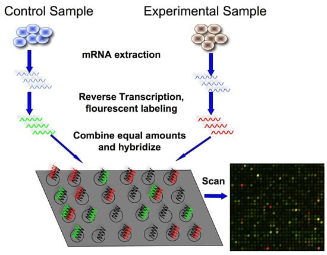

```{r style, echo = FALSE, results = 'asis'}
options(width=100)
knitr::opts_chunk$set(cache=TRUE, fig.align = TRUE, 
                      warning = FALSE,
                      message = FALSE, comment = "")
```

# Gettig started
This document can be reproduced by using the R code and the  data (for illustrating purposes and for the excersises) that are available here: https://github.com/isglobal-brge/post_omic


# Introduction

Transcriptomic data analysis can be performed using data obtained from two infrastructures: microarrays and RNA-seq. This lectures describe the main steps to perform differential expression analysis (DEA)  using microarray data. This is a brief introduction that covers the main aspects of DEA and outliens other methodologies that should be consider in this type of analyses but would require more than 2 hours. 

## Microarray workflow

A basic protocol for a DNA microarray is as follows:

- **Isolate and purify mRNA from samples of interest**. Since we are interested in comparing gene expression, one sample usually serves as control, and another sample would be the experiment (healthy vs. disease, etc)
- **Reverse transcribe and label the mRNA**. In order to detect the transcripts by hybridization, they need to be labeled, and because starting material maybe limited, an amplification step is also used. Labeling usually involves performing a reverse transcription (RT) reaction to produce a complementary DNA strand (cDNA) and incorporating a florescent dye that has been linked to a DNA nucleotide, producing a fluorescent cDNA strand. Disease and healthy samples can be labeled with different dyes and cohybridized onto the same microarray in the following step. Some protocols do not label the cDNA but use a second step of amplification, where the cDNA from RT step serves as a template to produce a labeled cRNA strand.
- **Hybridize the labeled target to the microarray**. This step involves placing labeled cDNAs onto a DNA microarray where it will hybridize to their synthetic complementary DNA probes attached on the microarray. A series of washes are used to remove non-bound sequences.
- **Scan the microarray and quantitate the signal**. The fluorescent tags on bound cDNA are excited by a laser and the fluorescently labeled target sequences that bind to a probe generate a signal. The total strength of the signal depends upon the amount of target sample binding to the probes present on that spot. Thus, the amount of target sequence bound to each probe correlates to the expression level of various genes expressed in the sample. The signals are detected, quantified, and used to create a digital image of the array.

If we are trying to calculate relative expression between two samples, each labeled with a different dye (See next figure, red for experiment, green for control), the resulting image is analyzed by calculating the ratio of the two dyes. If a gene is over-expressed in the experimental sample, then more of that sample cDNA than control cDNA will hybridize to the spot representing that expressed gene. In turn, the spot will fluoresce red with greater intensity than it will fluoresce green. The red-to-green fluorescence ratio thus indicates which gene is up or downregulated in the appropriate sample.


{width=80%}


  
`r Biocpkg("limma")` is a widely used BioC package for analyzing microarray data. LIMMA stands for "linear models for microarray data".  Perhaps unsurprisingly, `limma` contains functionality for fitting a broad class of statistical models called "linear models".  Examples of such models include linear regression and analysis of variance.  While most of the functionality of limma has been developed for microarray data, the model fitting routines of limma are useful for many types of data, and is not limited to microarrays.  For example, DNA methylation data is also used to be analyzed using this package.

## `limma` manual

- The limma User's Guide from the [limma webpage](http://bioconductor.org/packages/limma).  This is an outstanding piece of documentation which contains serveal examples of DEA for different designs that can be used to answer different scientific questions. It is without any doubt "the best resource on differential expression analysis available".

## Model design

The objective of an DEA is frequently to discover which features (genes) are different between groups or stated differently: to discover which genes are differentially expressed between cases and controls.  Of course, more complicated designs are also used; sometimes more than two groups are considered and sometimes there are additional important covariates such as age or sex that should be taken into accout (adjusted models).  

Broadly speaking, how samples are distributed between groups determines the **design** of the study.  In addition to the design, there is one or more question(s) of interest(s) such as the difference between two groups.  Such questions are usually formalized as **contrasts**; an example of a contrast is indeed the difference between two groups.

This can be formalized as 

$$ Y =  \beta_0 + \beta_1 X_1 + \epsilon $$

In this equation of a linear model, Y is the response variable. It must be a
continuous variable. In the context of DEA, it is a relative measure of mRNA expression level for one gene. $X_1$ is an
explanatory variable, which can be continuous or discrete, for example, control
group versus treatment, or mutant versus wild type. $\beta_1$ quantifies the
effect of the explanatory variable on the response variable. Furthermore, we can
add additional explanatory variables to the equation for more complicated
experimental designs. Lastly, \epsilon models the random noise in the
measurements.

In R, you specify a linear model with the function `lm`. This uses R's formula
syntax. On the left is the object that contains the response variable, and to
the right of the tilde are the objects that contain the explanatory variables.

```{r eval=FALSE}
lm(y ~ x1)
```

A second explanatory variable can be added with a plus sign.

$$ Y =  \beta_0 + \beta_1 X_1 + \beta_2 X_2 + \epsilon $$

```{r eval=FALSE}
lm(y ~ x1 + x2)
```

The design matrix is then, how samples are distributed accross x1 and x2. Let us illustrate this in a simple simulated case when DEA aims to find genes that are differentially expressed between cases and control (variable x1)

```{r show_design}
set.seed(1234) # to guarantee reproducibility
x1 <- as.factor(sample(c("case", "control"), 10, replace=TRUE))
x1
model.matrix( ~ x1)
```


The data structure represented by an `ExpressionSet` or a `SummarizedExperiment` contains features in the rows of the experimental data and variables in columns.

A number of different packages allows us to fit common types of models to this data structure

- `r Biocpkg("limma")` fits a so-called linear model; examples of linear models are (1) linear regression, (2) multiple linear regression and (3) analysis of variance.
- `r Biocpkg("edgeR")`, `r Biocpkg("DESeq")` and `r Biocpkg("DESeq2")` fits generalized linear models, specifically models based on the negative binomial distribution that will be illustrated in a later session.

Simplifyng, `r Biocpkg("limma")` is useful for continuous data such as microarray data and `r Biocpkg("edgeR")` / `r Biocpkg("DESeq")` / `r Biocpkg("DESeq2")` are useful for count data such as high-throughput sequencing (RNA-seq).  Though will see that count data can also be transformed into continuous data and, hence, `r Biocpkg("limma")` can also be used in that case. 

In addition to the distributional assumptions, all of these packages uses something called empirical Bayes techniques to borrow information across features.  As stated above, usually the number of samples is small and the number of features is large.  It has been shown time and time again that you can get better results by borrowing information across features, for example by modeling a mean-variance relationship.  This can be done in many ways and often depends on the data characteristics of a specific type of data.  For example both edgeR and DESeq(2) are very popular in the analysis of RNA-seq data and all three packages uses models based on the negative binomial distribution.  For a statistical point of view, a main difference between these packages (models) is how they borrow information across genes.


# Two group comparison

Let us illustrate how to perform DEA using `vdx` dataset which is available at Bioconductor through the package `r Biocexptpkg("breastCancerVDX")`. This package can be installed along with `limma` using: 


```{r install, eval=FALSE}
BiocManager::install(c("limma", "breastCancerVDX"))
```

After that, the packages can be loaded into R by:

```{r load_packages}
library(limma)
library(breastCancerVDX)
```

The `vdx` dataset from the `r Biocexptpkg("breastCancerVDX")` package is an `ExpressionSet` of women diagnosed with breast cancer. It contains information about 22,000 genes and several variables including estrogen receptor (ER) status.

```{r load}
data(vdx)
vdx
table(vdx$er)
```

The code `0` means negative and `1` positive estrogen receptor. Now we do a standard limma model fit

```{r limma}
design <- model.matrix(~ vdx$er)
fit <- lmFit(vdx, design)
fit <- eBayes(fit)
topTable(fit)
```

This is the common limma workflow.  First, the comparison of interest (and the design of the experiment) is defined through a so-called "design matrix".  This matrix basically encompasses everything we know about the design; in this case there are two groups (we have more to say on the design below).  Next, the model is fitted.  This is followed by borrowing strength across genes using a so-called empirical Bayes procedure.  Because this design only has two groups there is only one possible comparison to make: which genes differs between the two groups.  This question is examined by the `topTable()` function which lists the top differentially expressed genes.  In a more complicated design, the `topTable()` function would need to be told which comparison of interest to summarize.


An important part of the output is `logFC` which is the log fold-change.  To interpret the sign of this quantity you need to know if this is `1-0` (e.g. ER+ vs ER-) (in which case positive values are up-regulated in ER+) or the reverse.  In this case this is determined by the reference level which is the first level of the factor.

```{r level}
head(as.factor(vdx$er))
```

we see the reference level is `0` so positive values means it is down-regulated in ER-.  You can change the reference level of a factor using the `relevel()` function.  You can also confirm this by computing the `logFC` by hand, which is useful to know.  Let's compute the fold-change of the top differentially expressed gene:

```{r FCbyHand}
topTable(fit, n = 1)
genename <- rownames(topTable(fit, n=1))
typeMean <- tapply(exprs(vdx)[genename,], vdx$er, mean)
typeMean
typeMean["1"] - typeMean["0"]
```

confirming the statement.  It is sometimes useful to check things by hand to make sure you have the right interpretation.  Finally, note that limma doesn't do anything different from a difference of means when it computes `logFC`; all the statistical improvements centers on computing better t-statistics and p-values.

The reader who has some experience with statistics will note that all we are doing is comparing two groups; this is the same setup as the classic t-statistic.  What we are computing here is indeed a t-statistic, but one where the variance estimation (the denominator of the t-statistics) is *moderated* by borrowing strength across genes (this is what `eBayes()` does); this is called a moderated t-statistic.

The output from `topTable()` includes

- `logFC`: the log fold-change between cases and controls.
- `t`: the t-statistic used to assess differential expression.
- `P.Value`: the p-value for differential expression; this value is not adjusted for multiple testing.
- `adj.P.Val`: the p-value adjusted for multiple testing.   Different adjustment methods are available, the default is Benjamini-Horchberg.

How to setup and interpret a design matrix for more complicated designs is beyond the scope of this introduction.  The limma User's Guide is extremely helpful here.  Also, note that setting up a design matrix for an experiment is a standard task in statistics (and requires very little knowledge about genomics), so other sources of help is a local, friendly statistician or text books on basic statistics.

# Important issues

- Data normalization `r Biocpkg("oligo")` function `rma`
- Surrogate variable analysis `r Biocpkg("sva")`
- Cell-type estimation `biocLite('CellMix', siteRepos = 'http://web.cbio.uct.ac.za/~renaud/CRAN', type='both')`


Inflation (produced by batch effects or uncontrolled variables) is normally tested by using QQ-plot

 
```{r qqplot_asthma}
qqt(fit$t, df=fit$df.prior+fit$df.residual,
    pch=16,cex=0.2)
abline(0,1, col="red", lwd=2)
```

Surrogate variable analysis (SVA) can be used to correct for uncontrolled variables. The [sva package](http://bioconductor.org/packages/release/bioc/vignettes/sva/inst/doc/sva.pdf) can be used to this end. This procedure is implemened in the [MEAL package](https://bioconductor.org/packages/release/bioc/html/MEAL.html) that requires less R code. Note that `fNames` argument allows to add annotation to the results by passing any of the existing variables in the feature data (`fData`) of the `ExpressionSet` object
 
```{r de_meal}
library(MEAL)

# shows available annotated variabels
names(fData(vdx))


# DEA
ans <- runPipeline(vdx, variable = "er")
ans

# DEA + SVA
ans.sva <- runPipeline(vdx, variable = "er", sva=TRUE)
ans.sva


fit.meal <- getProbeResults(ans, coef=2, 
                       fNames=c("probe", "Gene.symbol", "Chromosome.location"))
head(fit.meal)
```


The QQ-plot is then produced by

```{r qqplot_meal}
plot(ans, type="QQ")
```

```{r qqplot_meal_sva}
plot(ans.sva, type="QQ")
```

There is still inflation, that may be due to cell-types differences, but this result can be considered acceptable. 

# Data visualization

Volcano plot can be use to visualize the genes that are differentially expressed at a given fold-change and p-value. The function `volcanoplot` from `limma` package can be used to this end. 

```{r volcanoplot}
volcanoplot(fit, coef=2, names = fit$genes$Gene.symbol, 
            highlight = 5)
```


`MEAL` has an user-friedly function to facilitate this visualization

```{r volcanoplot2}
plot(ans, type="volcano", tFC=3, tPV=45)
```


```{r volcanoplot3}
plot(ans.sva, type="volcano", tFC=0.7, tPV=5)
```

Another state-of-the-art plot is MA-plot. It is used to check whether data are comparable among groups (i.e. normalization worked properly). This can be created using a function available in `limma`.

```{r maplot}
plotMA(fit, coef=2, main="ER+ vs ER- comparison")
abline(h=0, col="red", lwd=2)
```


--------------------------------------------------

**EXERCISE**: `r Biocpkg("leukemiasEset")` provides transcriptomic data for different types of leukemias. It can be loaded into R by `data(leukemiasEset)` after loading the package. The variable `LeukemiaType` encodes several types of leukemia as well as control sampels (`NoL`). Perform a complete differential expression analysis comparing `CML` versus `NoL`.

--------------------------------------------------

# Acknowledgments

The description of the microarry experiment has been brougth from [bitesizebio](https://bitesizebio.com/7206/introduction-to-dna-microarrays/). Some parts of this material has been obtained from Kasper D. Hansen material of the course Bioconductor for Genomic Data Science

# Session info

\scriptsize

```{r}
sessionInfo()
```

